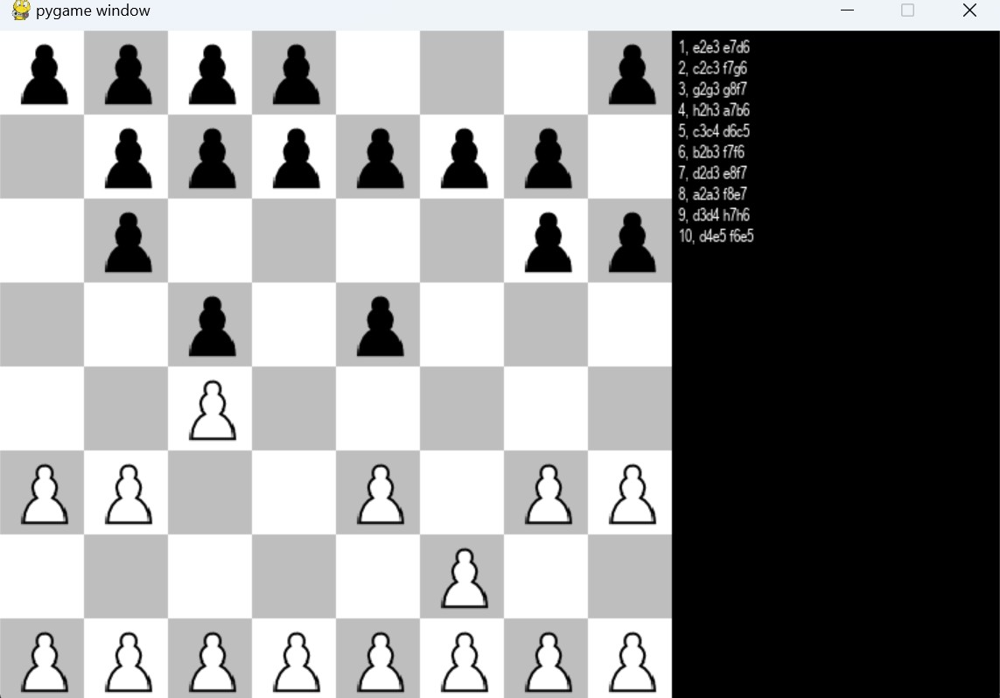

# ChessAI_NegaMaxAlphaBeta

ChessAI_NegaMaxAlphaBeta is an AI-powered GO game implemented using the NegaMax algorithm and Alpha-Beta Pruning.

## How to Play

1. **Run the Game:** Execute the following command to start the game:

    ```bash
    python chessmain.py
    ```

2. **Game Interface:** After the game starts, you'll see the GO game interface, including the board, pieces, and a simple user interface.



3. **Gameplay:** Make your moves and play against the AI opponent. The game screen will display the current game state, player, and AI scores, among other relevant information.

4. **End the Game:** Once the game is finished, you can close the game window.

## Important Notes

- This project utilizes the NegaMax algorithm and Alpha-Beta Pruning for AI decision-making.

- Ensure that your terminal supports ANSI colors for the optimal gaming experience.


